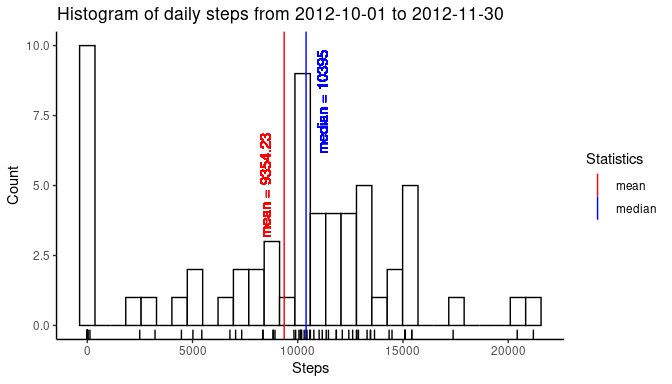
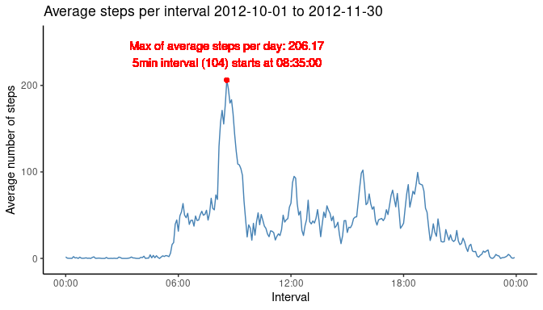
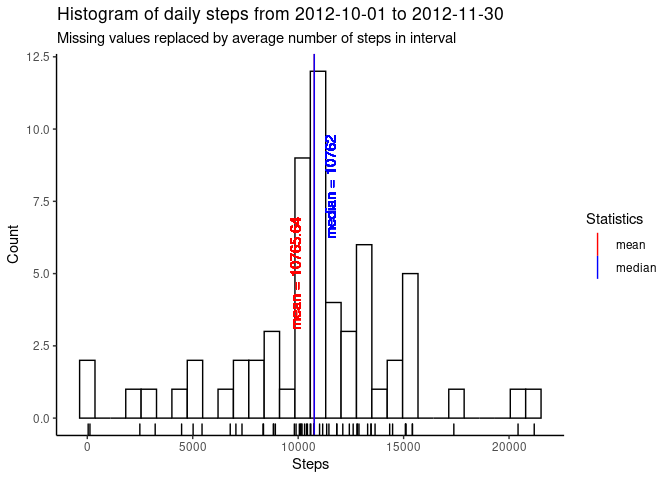
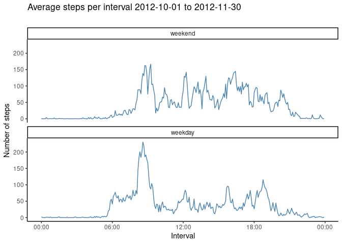

In this project, data stored in **activity.csv** hast to be loaded transformed and visualized.   
The main objective is to create reproducible research. R Markdown is used for this purpose.


```r
	library(dplyr)
```

```
## 
## Attaching package: 'dplyr'
```

```
## The following objects are masked from 'package:stats':
## 
##     filter, lag
```

```
## The following objects are masked from 'package:base':
## 
##     intersect, setdiff, setequal, union
```

```r
	library(ggplot2)	
	library(tibble)
	library(stringr)
	library(chron)
	library(knitr)

	# For head() to output all columns, we set the option below
	options(dplyr.width = Inf)
```

#### Helper functions
- <code>get_data</code> Gets **activity.csv**, either from the current directory or from the zip **activity.zip**.  
- <code>load_data</code> Loads the contents of  **activity.csv** as a data frame.  
- <code>pretty_num</code> Outputs numbers in a pretty format.


```r
get_data = function(data_file_1 ="./activity.csv",
		 file_dir = getwd(),
		 b_overwrite = TRUE){
	
	file_dest = file.path(file_dir, "activity.zip")
	
	# Extract data from zip if necessary
	
	if (!file.exists(data_file_1)){
		print("Get data file from zip.")
		
		unzip(file_dest,exdir = file_dir ) 
	}else{
		print("Data files already available.")
	}
}
```

```r
load_data = function(data_file_1 ="./activity.csv"){
	
	data = as_tibble(read.csv(data_file_1)) #
	
}
```


```r
pretty_num = function(x, digits = 2) sprintf(paste0("%1.",digits,"f"), x) 
```

## Loading and preprocessing the data
Firstly, we load the data. Afterwards, we transform the variables.
### Loading

```r
data = load_data()
head(data)
```

```
## # A tibble: 6 x 3
##   steps date       interval
##   <int> <fct>         <int>
## 1    NA 2012-10-01        0
## 2    NA 2012-10-01        5
## 3    NA 2012-10-01       10
## 4    NA 2012-10-01       15
## 5    NA 2012-10-01       20
## 6    NA 2012-10-01       25
```
- A data frame with 17568 observations.
- A data frame with ```{r echo = TRUE, collapse =TRUE}  nrow(data)``` observations.

### Processing/ transformation
Transform the columns:  
- Change date to **date** objects  
- Add more columns for **interval** which encodes the day as 5min intervals   
 - **interval_conv**  - date object with corrects dates and times of the intervals  
  - **interval_hms**  - character encoding the intervals HH:MM:SS  
  - **interval_plot** - dttm object used for plotting ("x" values); 
   these values are mapped to a single date (date of code execution)

```r
data = data %>%
	mutate(date = as.Date(date, "%Y-%m-%d"))%>%
	mutate(interval_conv = as.POSIXct( 
		paste(date,format( strptime(
		sprintf("%04d", interval),
		format= "%H%M"),"%H:%M:%S")),"%Y-%M-%D %H:%M:%S"),
		interval_hms = strsplit(as.character(interval_conv), " ")) 

i_hms =	sapply(1:nrow(data), function(i)data$interval_hms[[i]][2]) #strings
i_plot = as.POSIXct( i_hms, format="%H:%M:%S") # datetime for aggregation


data = data %>%
	mutate(interval_hms = i_hms,
	       interval_plot = i_plot) # hms as string
head(data)
```

```
## # A tibble: 6 x 6
##   steps date       interval interval_conv       interval_hms interval_plot      
##   <int> <date>        <int> <dttm>              <chr>        <dttm>             
## 1    NA 2012-10-01        0 2012-10-01 00:00:00 00:00:00     2021-01-15 00:00:00
## 2    NA 2012-10-01        5 2012-10-01 00:05:00 00:05:00     2021-01-15 00:05:00
## 3    NA 2012-10-01       10 2012-10-01 00:10:00 00:10:00     2021-01-15 00:10:00
## 4    NA 2012-10-01       15 2012-10-01 00:15:00 00:15:00     2021-01-15 00:15:00
## 5    NA 2012-10-01       20 2012-10-01 00:20:00 00:20:00     2021-01-15 00:20:00
## 6    NA 2012-10-01       25 2012-10-01 00:25:00 00:25:00     2021-01-15 00:25:00
```
- A data frame with 17568 observations.
- A data frame with ```{r echo = TRUE, collapse =TRUE} nrow(data) ``` observations.

## What is mean total number of steps taken per day?
For this question, we calculate the total numbers of steps taken per day, first.  
Subsequently, we calculate the mean values and plot these in a histogram.  
We also report the **median** and **mean** value of those values.

### Calculate the total number of steps taken per day

```r
data_proc = data %>%
	group_by(date) %>%
summarize(steps_per_day = sum(steps, na.rm = TRUE),n=n(), .groups="keep")

head(data_proc)
```

```
## # A tibble: 6 x 3
## # Groups:   date [6]
##   date       steps_per_day     n
##   <date>             <int> <int>
## 1 2012-10-01             0   288
## 2 2012-10-02           126   288
## 3 2012-10-03         11352   288
## 4 2012-10-04         12116   288
## 5 2012-10-05         13294   288
## 6 2012-10-06         15420   288
```
- A data frame with 61 observations (days).  
- A data frame with ```{r echo = TRUE} nrow(data_proc)``` observations (days).


### Calculate and report the mean and median of the total number of steps taken per day

```r
mean_day_proc   = mean( data_proc$steps_per_day, na.rm = TRUE)
median_day_proc = median(data_proc$steps_per_day, na.rm = TRUE)
```


```r
# Create a data frame to plot median and mean
df_features_proc = as_tibble( data.frame(
	name = c("mean", "median"),
	val =  c(mean_day_proc, median_day_proc),
	val_disp = c(round(mean_day_proc,digits = 2),
		     round(median_day_proc,digits = 2)),
	color = c("red","blue")))
df_features_proc
```

```
## # A tibble: 2 x 4
##   name      val val_disp color
##   <fct>   <dbl>    <dbl> <fct>
## 1 mean    9354.    9354. red  
## 2 median 10395    10395  blue
```
### Make a histogram of the total number of steps taken each day

We create the histogram via ggplot:  
- a histogram (<code>bins = 30</code>) with rug  
- vertical lines with **mean** and **median** values  

```r
# Create a histogram
g = ggplot(data_proc, 
       aes(x = steps_per_day)) 
g +	geom_histogram(
	               bins = 30,
		       color = "black", 
		       fill = "white"
		       )+
	geom_rug() +
	
# Mean and median value as vertical lines with text	
	geom_vline(data = df_features_proc, 
		   aes(
		   	xintercept = val,
		   	color = name),
		   linetype = "solid") +

	geom_text(aes(x = df_features_proc$val[1],
		      label = paste("mean =", df_features_proc$val_disp[1]),
		      y = 5), 
		  color = df_features_proc$color[1],
		  angle = 90,
		  vjust = -1.2) +

	geom_text(aes(x = df_features_proc$val[2],
		      label = paste("median =", df_features_proc$val_disp[2]),
		      y = 8), 
		  color = df_features_proc$color[2],
		  angle = 90,
		  vjust = 2)+
	scale_color_manual(name = "Statistics", 
			   values = c(mean = 'red',
			   	   median = 'blue')) +
	theme_classic() +
	labs( x = "Steps",
	      y = "Count",
	      	title = paste("Histogram of daily steps from",
			    as.character(data_proc$date[1]),
			    "to",as.character(data_proc$date[nrow(data_proc)])))
```

<!-- -->
  
- The **mean** number of total steps per day is: 9354.23  
- The **median** number of total steps per day is: 10395.00

- The **mean** number of total steps per day is: ``9354.23``    
- The **median** number of total steps per day is: ``10395.00``

## What is the average daily activity pattern?

### Which 5-minute interval, on average across all the days in the dataset, contains the maximum number of steps?
We create a new data frame <code>df_ts</code> to answer this question. <code>df_ts</code> groups columns by **interval_plot,interval_hms, interval**. We answer this question below the time series plot.


```r
# Create time series
df_ts = data %>%
group_by(interval_plot,interval_hms, interval) %>%
	summarize(mean_steps_interval = mean(steps,na.rm = TRUE),.groups ="keep")

head(df_ts)
```

```
## # A tibble: 6 x 4
## # Groups:   interval_plot, interval_hms, interval [6]
##   interval_plot       interval_hms interval mean_steps_interval
##   <dttm>              <chr>           <int>               <dbl>
## 1 2021-01-15 00:00:00 00:00:00            0              1.72  
## 2 2021-01-15 00:05:00 00:05:00            5              0.340 
## 3 2021-01-15 00:10:00 00:10:00           10              0.132 
## 4 2021-01-15 00:15:00 00:15:00           15              0.151 
## 5 2021-01-15 00:20:00 00:20:00           20              0.0755
## 6 2021-01-15 00:25:00 00:25:00           25              2.09
```
- A data frame with 288 observations (intervals).  
- A data frame with 

```r
 nrow(df_ts)
## [1] 288
```
observations (intervals).  

Then, we locate the idx of the interval which has the maximum value.

```r
# Locate interval with max average steps
max_avg_activity = max(df_ts$mean_steps_interval)
interval_max_idx = which(df_ts$mean_steps_interval == max_avg_activity)
interval_hms_max = df_ts$interval_hms[interval_max_idx]
interval_plot_max = df_ts$interval_plot[interval_max_idx]
```


### Time series plot of 5min intervals and average number of steps per interval
We generate a the time series plot by using the data frame **df_ts**.  


```r
# Create a time series plot
p = ggplot(data = df_ts, aes(
	x = interval_plot,
	y = mean_steps_interval)) 
p +	geom_line( color="steelblue") + 
	geom_point(x = interval_plot_max,
		   y = max_avg_activity,
		   color ="red") +
	geom_text(aes(x = interval_plot_max,
		      y = max_avg_activity,
		      label = paste0("Max of average steps per day: ",
		      	       round(max_avg_activity, digits=2),"\n",
		      	       "5min interval ","(",interval_max_idx,")", " starts at ",
		      	       interval_hms_max )), 
		  color = "red",
		  vjust = -0.5) +
	ylim(c(-5,max_avg_activity+50))+
	
	labs( x = "Interval",
	      y = "Average number of steps",
	      title = paste("Average steps per interval",
	      	      as.character(data_proc$date[1]),
	      	      "to",as.character(data_proc$date[nrow(data_proc)])))+
	theme_classic() + 
	scale_x_datetime(date_label = "%H:%M")
```

<!-- -->
  
Time interval number 104 which starts at 08:35:00 has the highest activity on average 206.17 steps).

Time interval number 

```r
 interval_max_idx
## [1] 104
```
which starts at 

```r
 interval_hms_max
## [1] "08:35:00"
```
has the highest activity on average (

```r
 pretty_num(max_avg_activity)
## [1] "206.17"
```
steps).


## Imputing missing values
### Calculate and report the total number of missing values in the dataset (i.e. the total number of rows with NAs

```r
NA_logical = is.na(data$steps)
sum_of_NAs = sum(NA_logical)
```
The total number of observations with missing steps is **sum_of_NAs = **2304.  


The total number of observations with missing steps is **sum_of_NAs = **

```r
 pretty_num(sum_of_NAs,0)
## [1] "2304"
```
.  


```r
# identify the days with missing data
incomplete_data = data %>%
	subset( !complete.cases(data))

num_total_days = length(unique(data$date))

num_incomplete_days = length(table(incomplete_data$date))
table(incomplete_data$date)
```

```
## 
## 2012-10-01 2012-10-08 2012-11-01 2012-11-04 2012-11-09 2012-11-10 2012-11-14 
##        288        288        288        288        288        288        288 
## 2012-11-30 
##        288
```
For 8 of 61 days data is missing.  

For 

```r
 num_incomplete_days
## [1] 8
```
of 

```r
 num_total_days
## [1] 61
```
 days data is missing.


###   Devise a strategy for filling in all of the missing values in the dataset  
For imputing the values, we use the mean values of the time intervals.

###   Create a new dataset that is equal to the original dataset but with the missing data filled in.
The new dataset **data_imputed** is created from the original dataset.

```r
data = 	mutate(data, steps_m = NA)
```


```r
# identify the intervals and replacement values
idx_imputed = c()
for (rr in 1:nrow(data)){
	steps_cur = data$steps[rr]
	if (is.na(steps_cur)){
		idx_imputed = c(idx_imputed,rr)
		imp_val_idx = which(df_ts$interval == data$interval[rr])
		data$steps_m[rr] = round(df_ts$mean_steps_interval[imp_val_idx])	
	}else{
		data$steps_m[rr] = steps_cur
	}
}

head(data$steps_m)
```

```
## [1] 2 0 0 0 0 2
```


```r
# the new data set without NAs 
data_imputed = data %>%
	mutate(steps = steps_m) %>% # remove the original values
	select(-steps_m) 
# remove the newly created variable from the input dataset
 data = data %>%
	select(-steps_m) 

# the new data set without NAs 
head(data_imputed)
```

```
## # A tibble: 6 x 6
##   steps date       interval interval_conv       interval_hms interval_plot      
##   <dbl> <date>        <int> <dttm>              <chr>        <dttm>             
## 1     2 2012-10-01        0 2012-10-01 00:00:00 00:00:00     2021-01-15 00:00:00
## 2     0 2012-10-01        5 2012-10-01 00:05:00 00:05:00     2021-01-15 00:05:00
## 3     0 2012-10-01       10 2012-10-01 00:10:00 00:10:00     2021-01-15 00:10:00
## 4     0 2012-10-01       15 2012-10-01 00:15:00 00:15:00     2021-01-15 00:15:00
## 5     0 2012-10-01       20 2012-10-01 00:20:00 00:20:00     2021-01-15 00:20:00
## 6     2 2012-10-01       25 2012-10-01 00:25:00 00:25:00     2021-01-15 00:25:00
```
- A data frame with 17568 observations.  

- A data frame with 

```r
nrow(data_imputed)
## [1] 17568
```
observations.   
- The variable **steps** contains the updated values. 

### Make a histogram of the total number of steps taken each day and report mean and median
Similarly to the original data frame, we compute the total number of steps taken each day and calculate **mean** and **median**.


```r
data_proc_imputed = data_imputed %>%
	group_by(date) %>%
	summarize(steps_per_day = sum(steps, na.rm = TRUE),
		  n=n(),
		  .groups="keep")
head(data_proc_imputed)
```

```
## # A tibble: 6 x 3
## # Groups:   date [6]
##   date       steps_per_day     n
##   <date>             <dbl> <int>
## 1 2012-10-01         10762   288
## 2 2012-10-02           126   288
## 3 2012-10-03         11352   288
## 4 2012-10-04         12116   288
## 5 2012-10-05         13294   288
## 6 2012-10-06         15420   288
```
- A data frame with 61 observations.  

- A data frame with 

```r
 nrow(data_proc_imputed)
## [1] 61
```
observations.  


```r
# Calculate mean and median of imputed data frame
mean_day_proc_imputed = mean(data_proc_imputed$steps_per_day, na.rm = TRUE)
median_day_proc_imputed = median(data_proc_imputed$steps_per_day, na.rm = TRUE)
```


```r
# Create a data frame to plot median and mean
df_features_proc_imputed = as_tibble( data.frame(
	name = c("mean", "median"),
	val =  c(mean_day_proc_imputed, median_day_proc_imputed),
	val_disp = c(round(mean_day_proc_imputed,digits = 2),
		     round(median_day_proc_imputed,digits = 2)),
	color = c("red","blue")))
```

#### Histogramm of modified dataset

```r
# Create a histogram
g = ggplot(data_proc_imputed, 
	   aes(x = steps_per_day)) 
g +	geom_histogram(
	bins = 30,
	color = "black", 
	fill = "white"
)+
	geom_rug() +
	
	geom_vline(data = df_features_proc_imputed, 
		   aes(
		   	xintercept = val,
		   	color = name),
		   linetype = "solid") +
	
	geom_text(aes(x = df_features_proc_imputed$val[1],
		      label = paste("mean =", df_features_proc_imputed$val_disp[1]),
		      y = 5), 
		  color = df_features_proc_imputed$color[1],
		  angle = 90,
		  vjust = -1.2) +
	
	geom_text(aes(x = df_features_proc_imputed$val[2],
		      label = paste("median =", df_features_proc_imputed$val_disp[2]),
		      y = 8), 
		  color = df_features_proc_imputed$color[2],
		  angle = 90,
		  vjust = 2)+
	scale_color_manual(name = "Statistics", 
			   values = c(mean = 'red',
			   	   median = 'blue')) +
	theme_classic() +
	labs( x = "Steps",
	      y = "Count",
	      title = paste("Histogram of daily steps from",
	      	      as.character(data_proc_imputed$date[1]),
	      	      "to",as.character(data_proc_imputed$date[nrow(data_proc_imputed)])),
	      subtitle ="Missing values replaced by average number of steps in interval")
```

<!-- -->

### Do these values (mean and median) differ from the estimates from the first part of the assignment? What is the impact of imputing missing data on the estimates of the total daily number of steps?
After imputing values, the values are different (as expected). The impact on mean and median values is given below:   

```r
mean_diff   = mean_day_proc_imputed   - mean_day_proc
median_diff = median_day_proc_imputed - median_day_proc
```
- **mean_diff=**1411.4098361
- **median_diff=**367

- **mean_diff=**``1411.4098361``
- **median_diff=**``367``

We also calculate the impact of imputing the values by comparing the data frames containing the original data where NAs are replaced by zeros and the modified data frame.


```r
# Init the data frame with the original dataset
data_diff = data.frame(date = data$date,
		       steps = data$steps)
# Impute missing steps 
data_diff$steps[NA_logical] = 0

# Difference according to day and interval
data_diff$steps = data_imputed$steps - data_diff$steps
```
We calculate the impact on the days with missing data.

```r
data_proc_diff = data_diff %>%
	group_by(date) %>%
	summarize(steps_per_day = sum(steps, na.rm = FALSE),
		  n=n(),
		  .groups="keep") %>%
	subset(steps_per_day!= 0) # subset only the days with NAs

# The difference between the data sets
data_proc_diff
```

```
## # A tibble: 8 x 3
## # Groups:   date [8]
##   date       steps_per_day     n
##   <date>             <dbl> <int>
## 1 2012-10-01         10762   288
## 2 2012-10-08         10762   288
## 3 2012-11-01         10762   288
## 4 2012-11-04         10762   288
## 5 2012-11-09         10762   288
## 6 2012-11-10         10762   288
## 7 2012-11-14         10762   288
## 8 2012-11-30         10762   288
```
## Are there differences in activity patterns between weekdays and weekends?
First, we create a new factor variable **wday_factor**. Afterwards, we calculate the average number of steps per interval based on the **wday_factor**. Then, we obtain the two time series containing the average values.
Finally, we plot a two-panel plot to show the difference between weekdays and weekends.  

#### Creation of factor variable to distinguish between weekend and weekdays

```r
# Init
data_imputed$wday_factor = 0

# Create meaningful factor
data_imputed$wday_factor[is.weekend(data_imputed$date)] = "weekend"
data_imputed$wday_factor[!is.weekend(data_imputed$date)] = "weekday"
data_imputed$wday_factor = factor(data_imputed$wday_factor,
				  levels = c("weekend","weekday"))
options(dplyr.width = Inf)
head(data_imputed)
```

```
## # A tibble: 6 x 7
##   steps date       interval interval_conv       interval_hms interval_plot      
##   <dbl> <date>        <int> <dttm>              <chr>        <dttm>             
## 1     2 2012-10-01        0 2012-10-01 00:00:00 00:00:00     2021-01-15 00:00:00
## 2     0 2012-10-01        5 2012-10-01 00:05:00 00:05:00     2021-01-15 00:05:00
## 3     0 2012-10-01       10 2012-10-01 00:10:00 00:10:00     2021-01-15 00:10:00
## 4     0 2012-10-01       15 2012-10-01 00:15:00 00:15:00     2021-01-15 00:15:00
## 5     0 2012-10-01       20 2012-10-01 00:20:00 00:20:00     2021-01-15 00:20:00
## 6     2 2012-10-01       25 2012-10-01 00:25:00 00:25:00     2021-01-15 00:25:00
##   wday_factor
##   <fct>      
## 1 weekday    
## 2 weekday    
## 3 weekday    
## 4 weekday    
## 5 weekday    
## 6 weekday
```
#### Creation of time series

```r
# Create the two different time series
df_ts_imputed = data_imputed %>%
	group_by(wday_factor,interval_plot,interval_hms, interval) %>%
	summarize(mean_steps_interval = mean(steps,na.rm = TRUE),.groups ="keep")

head(df_ts_imputed)
```

```
## # A tibble: 6 x 5
## # Groups:   wday_factor, interval_plot, interval_hms, interval [6]
##   wday_factor interval_plot       interval_hms interval mean_steps_interval
##   <fct>       <dttm>              <chr>           <int>               <dbl>
## 1 weekend     2021-01-15 00:00:00 00:00:00            0                0.25
## 2 weekend     2021-01-15 00:05:00 00:05:00            5                0   
## 3 weekend     2021-01-15 00:10:00 00:10:00           10                0   
## 4 weekend     2021-01-15 00:15:00 00:15:00           15                0   
## 5 weekend     2021-01-15 00:20:00 00:20:00           20                0   
## 6 weekend     2021-01-15 00:25:00 00:25:00           25                3.5
```
#### Two-panel time series plot showing the difference in activity patterns (weekdays vs. weekends)

```r
# Create a panel plot using ggplot facets
p = ggplot(data = df_ts_imputed, aes(
	x = interval_plot,
	y = mean_steps_interval)) +
	facet_wrap(~wday_factor,
		   nrow = 2) 
p +	geom_line( color="steelblue") + 
	labs( x = "Interval",
	      y = "Number of steps",
	      title = paste("Average steps per interval",
	      	      as.character(data_proc$date[1]),
	      	      "to",as.character(data_proc$date[nrow(data_proc)])),
	      subtitle = "")+
	theme_classic() + 
	scale_x_datetime(date_label = "%H:%M")
```

<!-- -->

